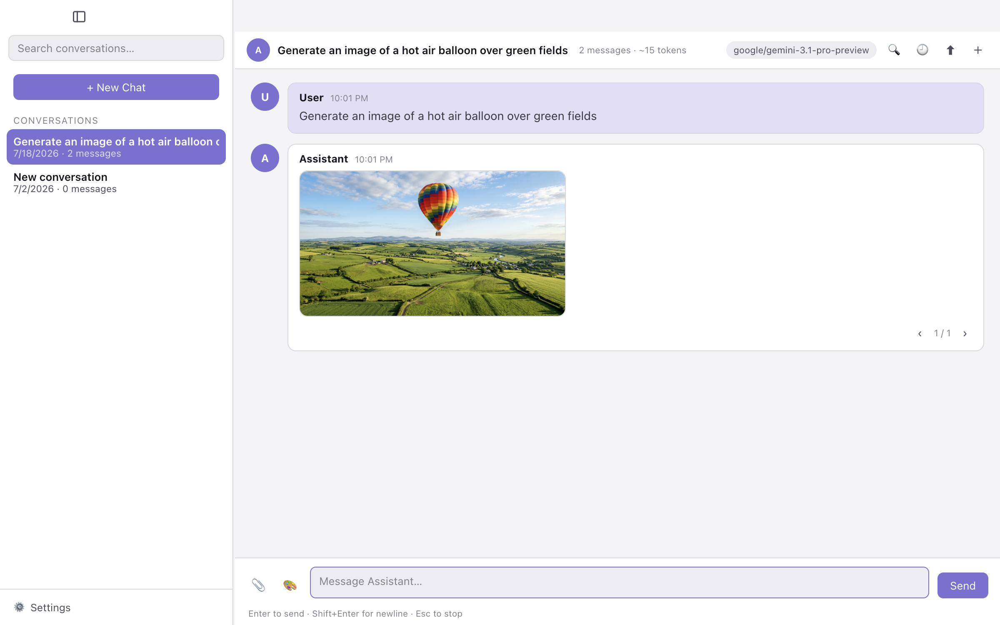
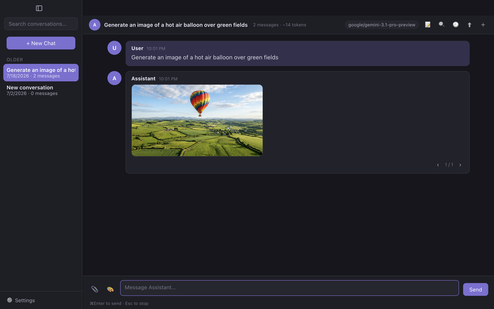

# OpenChat

[](https://github.com/cvl121/openchat/actions/workflows/test.yml)
[](LICENSE)
[](https://github.com/cvl121/openchat/releases/latest)

> **OpenChat is in beta.** It's stable for daily use, but expect rough edges and occasional breaking changes before 1.0. The project currently has a single maintainer, who aims to ship updates roughly every one to four weeks on a best-effort basis.

**OpenChat** — a fast, local-first, open-source desktop AI chat app with two personalities: a clean general-purpose assistant chat, and a full story/role-play environment inspired by [SillyTavern](https://github.com/SillyTavern/SillyTavern).

OpenChat is built for instant startup, no server, no browser tabs, all data on your machine — in a cross-platform codebase with zero build step and zero runtime dependencies (Electron and electron-builder are the only dev dependencies).

| Light | Dark |
|---|---|
|  |  |

## Why not just SillyTavern?

SillyTavern is the power tool: a browser app behind a Node server with a huge surface of extensions and knobs. OpenChat trades that surface for a double-clickable desktop app that works out of the box:

| | OpenChat | SillyTavern |
|---|---|---|
| Install | Download an installer, open it | Node.js + git + a server you keep running |
| First chat | Paste one API key in the setup wizard | Pick and configure an API backend first |
| Character cards, personas, lorebooks, swipes, presets | ✓ (TavernCardV2-compatible) | ✓ |
| Group chats, extensions, regex scripts, image pipelines | Not yet | ✓ |
| Also a clean general-purpose assistant app | ✓ (default mode) | — |

Your data stays compatible: character PNGs, world-info JSON, chat JSONL, and presets import directly from a SillyTavern install — and export back out.

## Highlights

- **Two app modes** — **Chat** (the default) is a straightforward AI assistant with conversation history, file uploads, and image responses. **Story** unlocks role-playing with character cards, personas, world lore, swipes, and story tools. Switch anytime in Settings → General.
- **Speaks your language** — the entire UI is available in **English, Spanish, Simplified Chinese, and Japanese**. It follows your system language automatically, or pick one in Settings → General → Language. Dates, relative times, search, and token counting are locale-aware, and the app menu switches too.
- **Bring your own key** — designed primarily around **OpenRouter** (one key, hundreds of models, live searchable model list), with **NanoGPT** (another one-key-many-models aggregator), OpenAI, Anthropic Claude, and Google Gemini also supported.
- **Attachments & images** — attach images and text files to messages (multimodal models see the images; text files are inlined), and image-capable models can reply with images that are saved locally.
- **Local-first** — characters, chats, settings, and API keys never leave your machine except as requests to your chosen AI provider. The only other network calls are an optional once-a-day version check against GitHub Releases (Settings → General) and an anonymous fetch of OpenRouter's public model catalog to show reference pricing for other providers' models (cached for ~6 hours).
- **Compatible formats** — TavernCardV2 character cards (PNG/JSON), SillyTavern-style JSONL chats, world info books, and presets. One-click import of an existing data folder.
- **Two user modes** — Regular mode keeps the UI clean and simple; Advanced mode unlocks deep customization of AI responses (see below).

## Chat vs. Story Mode

Switch in **Settings → General → App Mode**.

| | Chat (default) | Story |
|---|---|---|
| Streaming chat, history, search, export | ✓ | ✓ |
| Conversation list with automatic titles | ✓ | — (character roster) |
| File uploads (images & text) and image responses | ✓ | ✓ |
| Custom assistant system prompt | ✓ | — (per-character prompts) |
| Character cards, editor, PNG/JSON import-export | | ✓ |
| Personas, world lore books, generation swipes on greetings | | ✓ |
| Prompt overrides & reminder prompt (Advanced) | | ✓ |

Chat mode keeps the sidebar as a simple conversation list (rename, export, delete via right-click). Story mode is a full role-playing environment: it restores the character roster and all world-building tools.

## Features

### Chat
- **Streaming responses** rendered live as tokens arrive, with a Stop button / Escape key — plus automatic retry with backoff on rate limits and server errors, and a stall timeout so a dead connection never hangs a chat
- **File uploads** — attach images and text files via the 📎 button or drag-and-drop, or paste images from the clipboard; images go to multimodal models as image parts, text files are inlined into the prompt
- **Image generation** — enable in Settings → API to get a 🎨 button that sends your prompt to a dedicated image provider/model (separate from your chat model); generated images render in the chat and can be saved to Downloads or any folder. Asking the chat model for an image in a plain message also works: if the chat model can't produce one, the request is automatically re-routed to your image model
- **Chat compression** — long chats are summarized in the background (threshold configurable) so each new reply stops resending the full history; Advanced mode can customize the summarization prompt
- **Token counters** — live token estimate for your draft, plus a per-conversation counter (with compressed-message count) in the toolbar; estimates are script-aware (CJK text is counted at ~1 token per character) so context trimming works correctly for Japanese, Chinese, and Korean chats
- **Account balance** — OpenRouter users see their remaining credits in Settings → API
- **Model pickers that know your key** — model lists load automatically once a key is entered, for every provider
- **Swipes** — generate alternative responses and page between them; in Story mode, alternate greetings become swipes on the first message; older messages with stored swipes stay pageable
- **Message editing** — edit, delete, or copy any message, and regenerate the last response; "Save & Regenerate" re-runs the reply after editing any of your messages (editing an older one rewinds the chat to it); undo up to 10 steps with Cmd+Z
- **Continue & Impersonate** — extend the last response in place, or let the AI draft *your* next message into the input (Impersonate is Story mode only)
- **Branching** — fork any message into a new chat file; the original stays untouched in History
- **Quick model switcher** — click the model chip in the toolbar to search the provider's model list or jump back to a recent model, without a trip to Settings
- **Chat history** — every conversation auto-saves per character; switch, export, or delete past chats from the history picker; import SillyTavern/OpenChat `.jsonl` chats. Deletions go to the OS trash, not straight to oblivion
- **Unified search** — search the current conversation or all chats from one dialog; matching is case- and accent-insensitive ("jose" finds "José"), and results jump straight to the matching message
- **Tavern-flavored markdown** — `"dialogue"` (including CJK quoting: `「…」`, `『…』`, `“…”`), `*actions*`, and narrative text each get their own color; headers, bold, blockquotes, lists, tables, strikethrough, and rules are supported, with all input HTML-escaped
- **Links & code** — markdown and bare URLs open safely in your browser (http/https only); fenced code blocks get language-aware syntax highlighting (JS/TS, Python, JSON, Bash, CSS, HTML) and a one-click copy button — still zero dependencies
- **In-app updates** — a daily check against GitHub Releases shows a banner when a new version is out (toggle or run manually in Settings → General; no data about you is sent); one click downloads the update and restarts into it (macOS, Windows, and Linux AppImage — deb installs and source checkouts link to the release instead), and after you update, a one-time What's New dialog summarizes the changes in your language

### Characters & World Building
- **TavernCardV2 import/export** — PNG cards with embedded data (`chara` / `ccv3` tEXt chunks) and JSON cards; drag-and-drop files onto the sidebar to import; export as PNG or JSON from the editor or sidebar (the library grid exports PNG). Unknown card fields (`extensions`, V3 extras) survive the round-trip untouched
- **Full character editor** — description, personality, scenario, first message, alternate greetings, tags; Advanced mode adds system prompt, post-history instructions, example dialogue, a version field, and a full editor for the card's embedded lore book
- **Character books** — embedded lore entries with keyword triggers are honored during prompt building, editable in the character editor, and preserved on save
- **World Lore books** — standalone keyword-triggered lore, assignable globally or per character; entries support secondary keywords (require-both matching) and custom insertion order; SillyTavern world-info JSON imports, and books export back to SillyTavern-compatible JSON
- **Author's Note** — a per-chat style/direction note injected near the end of the prompt at a configurable depth (Story mode, 📝 in the toolbar)
- **Personas** — multiple user identities with avatars and descriptions; per-character persona overrides
- **Pinned characters** — keep favorites at the top of the sidebar (right-click a conversation)

### Prompt Assembly

Prompts are assembled in this order:

```
system prompt → character description/personality/scenario → persona
→ character book entries (constant + keyword-triggered)
→ world info (constant + keyword-triggered) → example dialogue (few-shot)
→ compression summary → chat history (Author's Note spliced in at its depth)
→ reminder prompt → post-history instructions
```

`{{char}}` and `{{user}}` template variables are replaced throughout.

## Regular vs. Advanced Mode

Switch in **Settings → General → User Mode**.

| | Regular | Advanced |
|---|---|---|
| Provider, API key, model picker | ✓ | ✓ |
| Temperature, max tokens, streaming toggle | ✓ | ✓ |
| Chat styling, themes, personas, world lore | ✓ | ✓ |
| Full samplers (top-p, top-k, min-p, top-a) | | ✓ |
| Repetition control (frequency/presence/repetition penalties) | | ✓ |
| Stop sequences, seed, context size | | ✓ |
| **Generation presets** (save/load, SillyTavern import/export) | | ✓ |
| **System prompt override** and **reminder prompt** | | ✓ |
| Base URL overrides (proxies, OpenAI-compatible endpoints) | | ✓ |
| Character editor extras (system prompt, examples, post-history) | | ✓ |
| Developer mode (live API request/response log) | | ✓ |

Regular mode is the default — everything works out of the box with sensible parameters. Advanced mode is for users who want to tune exactly how the AI responds.

## AI Providers

| Provider | What you need | Notes |
|----------|---------------|-------|
| [OpenRouter](https://openrouter.ai) | API key | **Recommended.** Hundreds of models, live model list, credit balance display, advanced samplers passed through. |
| [NanoGPT](https://nano-gpt.com) | API key | Pay-as-you-go aggregator with hundreds of models; live model list with context sizes and pricing, advanced samplers passed through. |
| [OpenAI](https://platform.openai.com) | API key | GPT models via Chat Completions. |
| [Anthropic Claude](https://console.anthropic.com) | API key | Messages API with proper system-prompt and turn-alternation handling. |
| [Google Gemini](https://aistudio.google.com) | API key | Streaming via SSE. |

All requests run in the Electron main process (no CORS issues) and stream. Rate limits and server errors retry automatically with backoff; a stalled stream times out after two minutes. OpenAI reasoning models (o-series, GPT-5) get their parameter quirks (`max_completion_tokens`, unsupported sampler settings omitted) handled for you. Use **Settings → API → Test Connection** to verify a key with a tiny request.

## Getting Started

**Download**: grab the installer for your platform from the [latest release](https://github.com/cvl121/openchat/releases/latest) — macOS builds (Apple Silicon & Intel, DMG/zip) are signed and notarized; a Windows 10/11 installer is included (unsigned for now, so SmartScreen may ask you to confirm via "More info → Run anyway"); Linux ships as AppImage and deb. Only the newest release is kept downloadable — older installers are pruned automatically, and the in-app updater always moves you to the current version.

**Or run from source**:

```bash
cd openchat
npm install
npm start
```

1. **Connect** — the first-run wizard walks you through picking a provider and pasting a key, with a built-in connection test. OpenRouter is the recommended starting point.
2. **Chat** — you start in Chat mode: just send a message to the assistant.
3. **Optional: switch to Story mode** — Settings → General → App Mode, then drag a TavernCardV2 PNG/JSON onto the sidebar, use Characters → Import, or create a character from scratch.

### Importing an Existing Data Folder

Settings → Data → **Import Data Folder**: select an existing OpenChat data folder (same layout — `characters/`, `chats/`, `worlds/`, `presets/`, `user/`) and its characters, chats, world books, presets, and personas are copied over.

## FAQ

**Which provider should I start with?** OpenRouter — one key gives you hundreds of models (including some free ones), a live searchable model list, and a credit-balance display. [NanoGPT](https://nano-gpt.com) is a similar one-key aggregator if you prefer it.

**What does OpenChat cost?** The app is free and open source. Cloud providers bill you directly for what you use through your own API key; nothing goes through us.

**Is my chat data private?** Everything is stored on your machine (see [Data Storage](#data-storage)). Messages are sent only to the provider you configured, and API keys are encrypted at rest where the OS supports it. See the Local-first bullet above for the two other network calls the app makes.

**How do I move to a new machine?** Copy your data folder over, then Settings → Data → Import Data Folder. API keys are not part of the import (they're encrypted per-machine) — re-enter them once.

**Connection problems?** Use Settings → API → Test Connection — it verifies your key with a tiny request and reports the exact provider error if one comes back.

## Keyboard Shortcuts

| Shortcut | Action |
|----------|--------|
| Cmd/Ctrl + N | New chat |
| Cmd/Ctrl + Shift + N | New character |
| Cmd/Ctrl + F | Search |
| Cmd/Ctrl + Shift + H | Chat history |
| Cmd/Ctrl + R | Regenerate last response |
| Cmd/Ctrl + Z | Undo message edit/delete |
| Cmd/Ctrl + , | Settings |
| Cmd/Ctrl + \ | Toggle sidebar |
| Ctrl + Tab / Ctrl + Shift + Tab | Next / previous conversation |
| Enter / Shift+Enter | Send / newline (configurable; Cmd/Ctrl+Enter sends when send-on-Enter is off) |
| ↑ (in empty input) | Edit your last message |
| Double-click a message | Edit it |
| Escape | Stop generating / close dialog |

## Data Storage

Everything lives in Electron's user-data directory — macOS: `~/Library/Application Support/OpenChat/`, Windows: `%APPDATA%\OpenChat\`, Linux: `~/.config/OpenChat/`:

| Data | Format | Location |
|------|--------|----------|
| Characters | PNG with base64 JSON in a `chara` tEXt chunk | `characters/` |
| Chats | JSONL (line 1 = metadata, then one message per line) | `chats/{CharacterName}/` |
| Settings & API keys | JSON — keys encrypted at rest via the OS credential store (macOS Keychain, Windows DPAPI, Linux Secret Service/keyring); stored in plain text if no credential store is available | `user/settings.json` |
| World info | JSON | `worlds/` |
| Personas | JSON + avatar images | `user/personas.json`, `User Avatars/` |
| Presets | JSON | `presets/` |
| Uploads & generated images | Original files | `uploads/` |

## Not (Yet) Implemented

These features were left out for now to keep OpenChat focused on core functionality, speed, and ease of use:

- Group chats (multi-character turn-taking)
- Dedicated image-generation pipelines (DALL-E / Stability / NovelAI) — image responses from image-capable chat models are supported
- Regex find-and-replace scripts
- Message drag-reorder
- NovelAI text provider
- Per-conversation chat style overrides (global styling is supported)

## Contributing

Contributions are welcome, with one ground rule up front: **pull requests are by invitation**. To keep the project maintainable, PRs are only accepted from approved contributors, and PRs from other accounts are closed automatically — see [CONTRIBUTING.md](CONTRIBUTING.md). OpenChat has a single maintainer for now, so allow a few days for responses to issues.

Found a security vulnerability? Please report it privately — see [SECURITY.md](SECURITY.md).

**How to contribute:**

1. **Report bugs or request features** on the [issue tracker](https://github.com/cvl121/openchat/issues). For bugs, include your OS, the OpenChat version (Settings → General), and steps to reproduce.
2. **Want to submit code?** Open an issue first describing the change you have in mind. If it's a good fit, we'll discuss the approach there and invite you to contribute.
3. **Before a PR**: keep changes dependency-free (plain JavaScript, no build step, no framework, no runtime dependencies), match the surrounding code style, and make sure `npm test` passes. Tests run on every pull request and on pushes to main.
4. **Translations**: the UI is localized via plain-JS dictionaries in `src/shared/locales/` (one flat `'key': 'string'` file per language, English as the source of truth). Fixing a translation is a normal code change; proposing a new language starts with an issue. A test enforces that every locale has exactly the English key set with all `{placeholders}` intact, so `npm test` will catch mistakes.
5. **Good first contributions**: translation fixes, bug reports with clear reproduction steps, and documentation improvements are the easiest ways to get involved — and the fastest route to a contributor invitation.
6. **Code conventions**: user-facing text never lives in components — add a key to `src/shared/locales/en.js` (and every other locale) and reference it with `t('key')`. Build DOM through the `el()` helper in `src/renderer/js/util.js` rather than `innerHTML`. New behavior should come with a unit test in `tests/`.

### Development

```bash
git clone https://github.com/cvl121/openchat && cd openchat
npm install
npm start     # run the app
npm test      # run the unit tests (node --test)
```

Layout: `src/main/` is the Electron main process (LLM providers in `llm.js`, disk layer in `storage.js`, IPC surface in `ipc.js`), `src/renderer/` is the UI (views in `js/views/`, prompt assembly in `js/promptBuilder.js`), and `src/shared/` is code used by both sides (provider registry, i18n runtime and locale dictionaries, text helpers).

Debugging tips: switch to Advanced mode and open Settings → Developer for a live log of every API request and response; app data (including chat JSONL you can inspect directly) lives in the user-data directory listed under [Data Storage](#data-storage); the unit tests run in about a second, so `npm test` after every change is cheap.

## License

OpenChat is free software, licensed under the [GNU Affero General Public License v3.0](LICENSE). You may redistribute and/or modify it under the terms of the AGPL; any distributed modified version must also be licensed under the AGPL and make its source available — including when the modified version is offered to users over a network.
